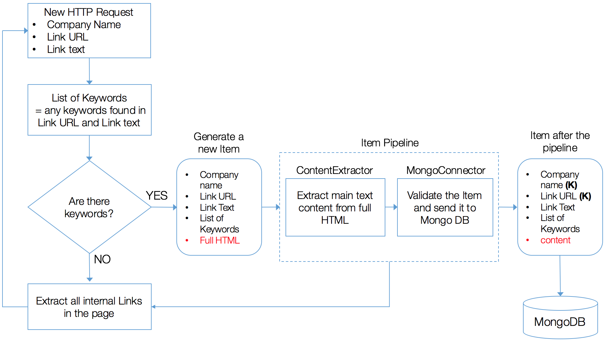

# Measuring Sustainability Reporting using Web Scraping and Natural Language Processing

Nowadays the Web represents a medium through which corporations can effectively disseminate and demonstrate their efforts to incorporate sustainability practices into their business processes.

This led to the idea of using the Web as a source of data to measure how UK companies are progressing towards meeting the new sustainability requirements recently stipulated by the United Nations with the Sustainable Development Goals (SDGs).

The aim of this research was to carry out an initial proof-of-concept for the indicator *"Number of companies publishing sustainability reports, by turnover band, geography, national or global company, sector and number of employees”*. This indicator relates to [SDG Target 12.6](https://sustainabledevelopment.un.org/content/documents/11803Official-List-of-Proposed-SDG-Indicators.pdf) which is *“To encourage companies, especially large and transnational companies, to adopt sustainable practices and to integrate sustainability information into their reporting cycle”*.

This repository describes the steps taken to develop a web scraping program able to collect sustainability information from companies websites.


## What does it do?
Web scraping is a technique employed to extract data from websites programmatically, without the need of a user interaction.

The scraper navigates through each company website, accessing every internal link. While recursively traversing websites, the scraper flags<sup>1</sup> only the web pages that suggest sustainability content.

Once a page is found, it needs to be cleaned before it is saved in a [MongoDB database](https://www.mongodb.com/).
In fact, web pages are often cluttered with additional features, such as navigation panels, pop-up ads and advertisements, around the main textual content.
These noisy parts tend to affect the performances of NLP tasks negatively.

To avoid this, content extraction methods exist to analyse the HTML behind a webpage and extract what is considered to be the important text.

In our scenario, this task is integrated in the scraper architecture and assigned to the **ContentExtractor** component of the Item Pipeline. The ContentExtractor receives the raw web page and extracts just the main textual content using the machine learning based library  [Dragnet](https://github.com/seomoz/dragnet).

The Item then proceeds to the **MongoConnector**, which checks its validity before sending it to a MongoDB database.

A high-level overview of the architecture of the scraper is shown in the next figure.





<span style="font-size: 8px;"><sup>1</sup> Pages are flagged if at least one of the predefined keywords is found in the URL address of the page or the text of the hyperlink leading to the page. Keywords were chosen by inspecting a sample of websites and looking at what were the most common words used to introduce sustainability content. </span>


## How do I use it?

### Requirements/Pre-requisites

Database: MongoDB, local mode

Python modules required:
* Scrapy
* pymongo
* dragnet

Python version: 2.7


### How to run the project locally

To put the spider to work, go to the scraper’s top level directory and run:
```
scrapy crawl SustainabilityBot
```

### Project Structure

Repository structure:

    .
    ├── docs
    │   ├── diagram.png
    │   └── index.html
    ├── documentation
    │   ├── SustainabilityRepoting-NTTS-2017.pptx
    │   └── SustainabilityRepoting.pdf
    └── scraper
        ├── scrapy.cfg
        ├── seeds.txt
        └── reports
            ├── items.py
            ├── pipelines.py
            ├── settings.py
            └── spiders
               └── web.py

* ``docs`` contains the html page included in the scraper's User Agent where to find out more information about the project.
* ``documentation`` contains a 10-pages report on the pilot study conducted and the slides used for the talk given at the [Eurostat NTTS 2017 Conference](https://ec.europa.eu/eurostat/cros/content/ntts-2017_en).
* ``scraper`` is a project based on ``Scrapy`` which contains the web scraping program to search and extract sustainability related web pages from the companies listed in ``seeds.txt``.

### Data
Fields, data types, and description of the scraped pages stored as MongoDB [documents](https://docs.mongodb.com/manual/core/document/).

Field  |   Data type  | Description
------------- | ------------- | -------------
\_id  | ObjectId 	| Unique Index automatically created by MongoDB for each document
company  | string  | Company Name. This field is part of the compound key for this collection
url  | string 	| The URL of the webpage. This field is part of the compound key for this collection
link_text  | string  | The link text, i.e. the text that was used to indicate the URL on the page where the link was found
content  | array 	| The textual content of the webpage extracted using the dragnet library
keywords  | array  | The list of unique keywords found either in the link text or in the link URL


An example of scraped page as stored in MongoDB:
```
{
  "_id": ObjectId("57bc03269ff1021cbe014200"),
  "company": "John Lewis Partnership",
  "url": "http://www.johnlewispartnership.co.uk/csr/our-environment/environmental-performance.html",
  "link_text": "Environmental Performance",
  "content": "We are committed to increasing the energy efficiency of our buildings, procuring low carbon energy and finding more efficient ways to distribute our goods, as well as encouraging innovation.
	Our overarching aim is to achieve a 65% reduction in carbon intensity (tonnes per £m sales) by 2020/21 against a 2010 baseline and by 2020 we want to eliminate all of our operational waste going to landfill.
	Prior years’ data is reported in line with our financial reporting period.
	2015 data is reported on an approximate calendar year basis which comprises the period from 21 December 2014 to 26 December 2015.
	Going forward, the annual results will be prepared on an approximate calendar year basis.",
  "keywords": [
		"environment",
		"csr"
	]

}
```

## Useful links
Additional details regarding the analysis of the content extracted by the scraper and about the results of the pilot study can be found in the [documentation](documentation) folder.

## Contributors

[Alessandra Sozzi](https://github.com/AlessandraSozzi), working for the [Office for National Statistics Big Data project](https://www.ons.gov.uk/aboutus/whatwedo/programmesandprojects/theonsbigdataproject)

## LICENSE

Released under the [MIT License](LICENSE).
